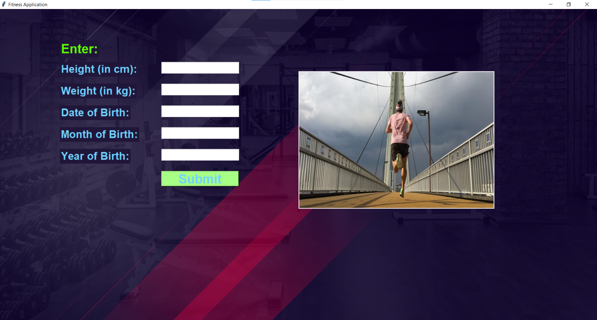

# Basic Fitness Application
This project contains an application developed in python inspired by health and fitness. The fitness application can perform the following function:
1. Register a new user (eg. UserID - U10002)
2. Update the user details
3. Generate statistics on the user entries (BMI, Body Fat %, Lean Body Mass, Body Water)

Libraries used:
1. sqlite3
2. tkinter
3. PIL

A quick look at the application:

This repository acts a submission for major innovative assignment for the course - Programming for Scientific Computing (PSC - 2CS404) while pursuing B.Tech CSE at Nirma University.